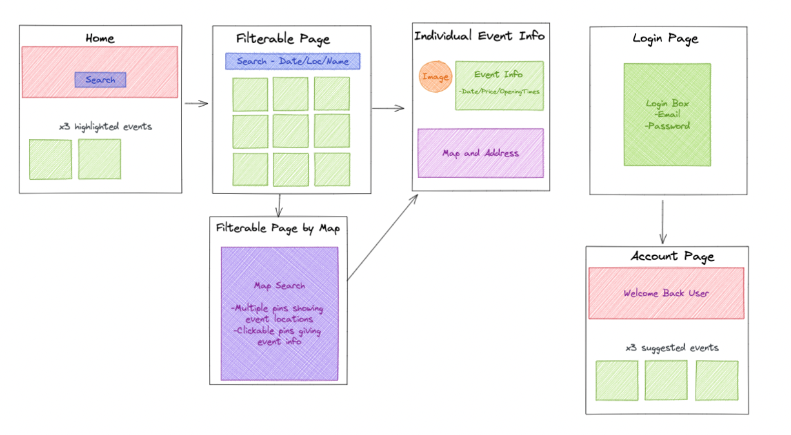
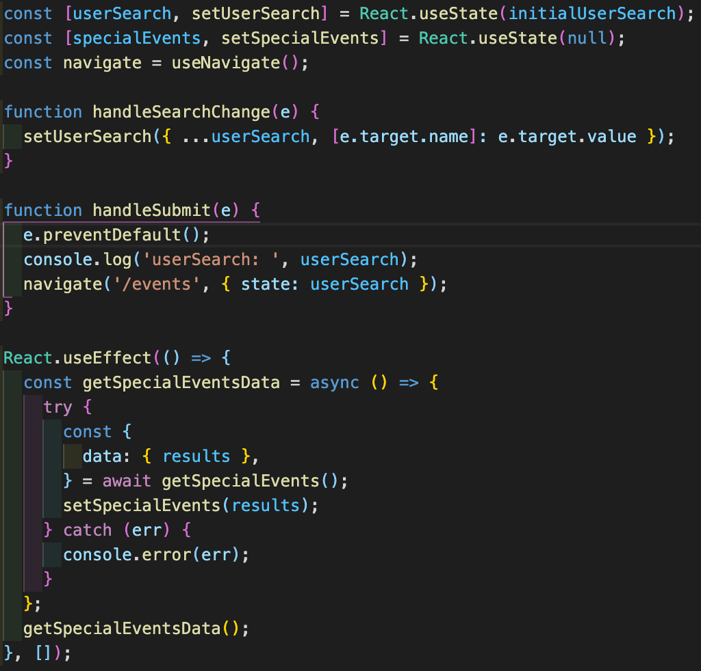
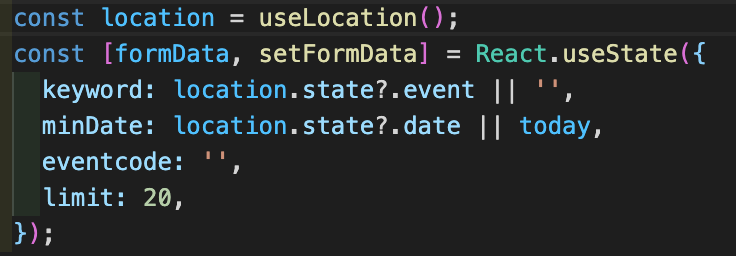
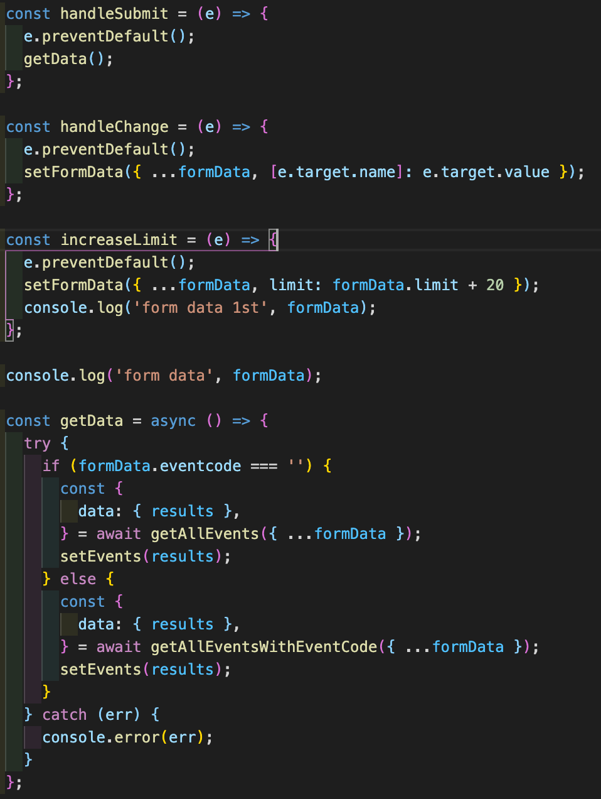
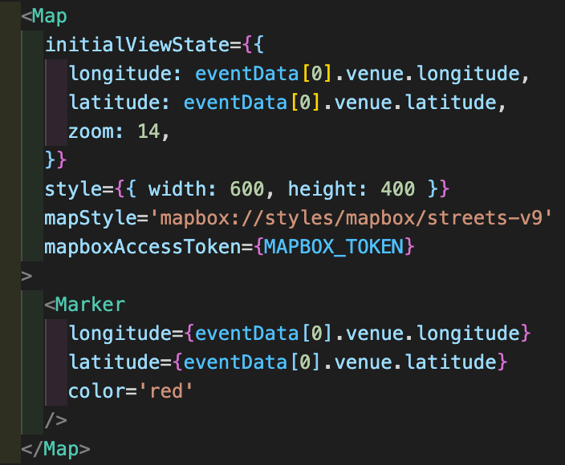

# Great Night Out - GA SEI Project 2

## Project Overview

Great Night Out is a front-end React app that consumes a public API. The project was a 48-hour hackathon challenge, which was pair-coded with [Elise La Rooy](https://github.com/eliselarooy). The app is designed to provide information on events happening across the UK, including search functionality, maps and suggested events.

**TECHNOLOGIES USED:** React, Axios, Bulma, SCSS, Postman, react-router-dom, react-map-gl, Netlify
**API USED:** [https://www.skiddle.com/api/](https://www.skiddle.com/api/)

**LINK:**

# The Brief

- **Consume a public API**
- **Have several components**
- **The app can have a router**
- **Be deployed online**

## Approach

### **1) Planning**

The first stage of planning was deciding which API we wanted to use in the project. Elise and I were pretty set on using an events API and after much trial and testing in Postman, we settled on the Skiddle API, which we found not only returned a large amount of useful, well structured information, but also was incredibly versatile with different endpoints and query-param functionality for searches.

The second stage of planning was wireframing our expected final product. We did this in Excalidraw and settled upon a very simple design with a Home Page, Search Page and then a page for individual events and this was to be our MVP. On top of this we also had a few stretch goals including a login and profile page and a map search page. We used Trello as a task organiser and coded with a mixture of pair programming and solo programming, coming back together to merge conflicts and review each other's code. While Elise focussed primarily on the EventIndex page, my main attention was on the Home Page and Event Show pages, including incorporating react-map-gl.

### **2) Functionality**

#### The Home page

The home page was designed to introduce the user to the site and consists of displaying a hero image and title. In addition to that, there was the functionality of the search bar and featured events section to include. Two pieces of state were used, one for 'userSearch' and one for 'specialEvents'. On page load the React.useEffect() was called, which using axios fetched three special events dictated by the Skiddle API and updated the 'specicalEvents' state. This was then rendered on the page using Bulma and the EventCard.js component.

The 'userSearch' state was updated onChange if either the rendered inputs for 'search for event' or 'date' were changed. On the click of the submit button, the useNaviagte hook was used to navigate the user the the Events Index page as well as pass the already entered search information.

#### The Events Index Page

The events index page is a page to initially display all the upcoming events returned from the API, before displaying a smaller list of events once the user has submitted a search. It used the 'EventCard.js' component to display each event card by mapping over the data returned from the Skiddle API.

On page load, the 'formData' state is initially set to a blank canvas of data to allow all events to be rendered on the page. The exception for this is if the user has already inputted data into the search bar on the Home page, in which case the 'useLocation' hook from the react-router-dom library is applied to access that data and update the initial 'formData' state to the user inputted values from the home page.

Once again, in a similar way to the home page worked, a form is displayed on screen, which onChange updates the relevant piece of state within 'formData', using 'e.target.name'. Likewise, onClick of the 'Search' button, the 'handleSubmit' function is called, which calls the getData function, which in turn using axios fetches the data from the Skiddle API using the queryparams from the 'formData' state.

#### The Event Show Page

The event show page is designed to show the in-depth details of each individual event once clicked on in the Events Index Page. The specific event was passed by using the 'useParams' hook in the react-router-dom library. Using this passed id, the event data was fetched from the API in a React.useEffect() using axios and displayed on the page. In addition to displaying the event details, react-map-gl was also used to display a map of the event’s location. This was a simple install and then incorporation of the Map component, which required the longitude and latitude of the event location, a secret key and some styling. The Map component also took a sub-component of a Marker, which again used the latitude and longitude to specify the marker's location.

#### The Login, Register and Navbar Components

The login and register components were simple forms, which updated a piece of state onChange. In the register component, on submit of the form, the user's data was stored in local storage. This was then accessed on submit of the users form in the login component and checked against the login form data to ensure the user was registered. (This was a very simple demonstration of local storage and more effective login and register methods can be seen in my later projects using tools such as jwt-tokens.)

The Navbar component was a simple display which used the 'Link' hook from the react-router-dom library for each section to ensure the user was navigated to the correct page upon click. For example, if the user clicked the login text, they were navigated to the login page.

#### Styling

The majority of styling for this project was done using the CSS framework Bulma. This framework was great to work with and my first project doing so. It was very simple to master and had some great in-built features, such as the navbar and forms. A very small amount of styling was done using Sass, but the tightness of Bulma restricted the additional CSS that could be applied to the project. Overall, Bulma was a great tool to create a good looking app quickly.

## Wins & Blockers

### **Wins:**

- A successfully functioning and extensive app, with no obvious bugs created in under 48hrs was a great achievement.
- Implementing reat-map-gl into the project was a big win. Although challenging at first, it displays and renders well on the page and functions in the way it is designed.

### **Blockers:**

- Allowing the user to search from both the main home page and events index page was challenging, but was successfully overcome by using the "useLocation" hook from the react-router-dom library.
- Trying to get the map from react-map-gl to function in the way I wanted and display the pin in the correct location took some time, but was resolved by ensuring there were no CSS conflicts with the map and its packages.

## Bugs

- Occasionally, depending on the number of events listed on the index page after a search, the "Load more events" button appears inline with the event cards, instead of displaying below the rendered cards.

## Future Improvements

- The addition of a map search page was a stretch goal we would have liked to have implemented, but ultimately ran out of time in the 48hrs. This was sketched out on our wireframes diagram and would be a react-map-gl with multiple pins showing upcoming events. The idea was to have these pins clickable, which would then take you through to the individual events page.

## Key Takeaways

As my first pair-programming project it was not only a great opportunity to learn from somebody else, but I also learnt a lot about how to code alongside someone and the management of that, such as; working with Git branches and merging conflicts. Likewise, this was my first React app and I built on my knowledge of conditional rendering, working with state, passing props using URLs, consuming APIs and leveraging different end points. Overall, I thoroughly enjoyed working on this project, learned a huge amount and am delighted with the end product.

## Contact:

- Github: github.com/FouldsEJ
- Linkedin: linkedin.com/in/edwardfoulds
- Portfolio: edwardfoulds.co.uk
